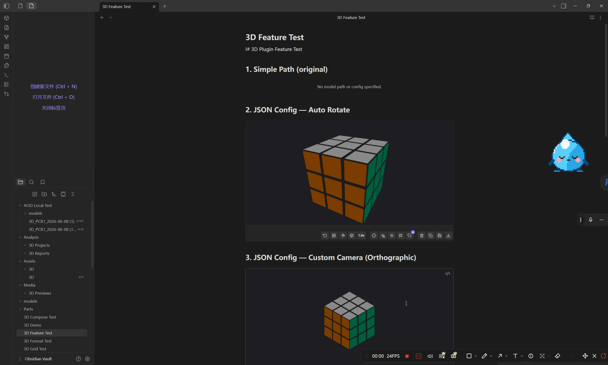

# AI Model Workbench

> 一个以本地优先和知识库整合为核心的 Obsidian 3D 查看插件，可在本地 WebGL 视口中查看常见 3D 资产、标注关键部位，并将模型整理为可链接的知识笔记。单模型预览（GLB、GLTF、STL、PLY、OBJ）现在默认走 Three.js 渲染路径，可通过“预览兼容模式”回退到 Babylon.js；文件视图 workbench 可以选择启用实验性 Three.js GLB/GLTF 路径，并保留 Babylon.js 自动回退；`3dgrid` 与 SPLAT 仍保留在 Babylon.js 能力路径上。

[AI Model Workbench](https://community.obsidian.md/plugins/ai-model-workbench)

[English](README.md) | **简体中文**



---

## 目录

- [功能特性](#功能特性)
- [当前版本](#当前版本)
- [平台支持矩阵](#平台支持矩阵)
- [快速入门](#快速入门)
- [安装](#安装)
- [格式支持](#格式支持)
- [使用方法](#使用方法)
- [设置选项](#设置选项)
- [外部依赖](#外部依赖)
- [安全与隐私](#安全与隐私)
- [资金与赞助](#资金与赞助)
- [技术细节](#技术细节)
- [已知限制](#已知限制)
- [部署指南](#部署指南)
- [许可证](#许可证)

---

## 功能特性

- **直接预览** GLB/GLTF、STL、OBJ、PLY（默认全部走 Three.js 渲染路径）
- **可选转换** CAD、FBX、3MF、DAE 等资产到 GLB
- **混合预览路由**：单模型预览（GLB/GLTF/STL/PLY/OBJ）默认走 Three.js，可在设置中回退到 Babylon.js
- **内联与文件视图**：实时预览、代码块、直接文件查看
- **网格系统**：在单个视口中渲染多个模型，支持预设布局
- **3D 标注**：点击模型表面添加带标签和颜色的书签，支持深度遮挡
- **知识笔记**：从已加载的模型生成结构化 Markdown，并自动注册捕获到的零件候选用于跨模型复用识别
- **快照功能**：复制、保存或下载渲染预览为 PNG
- **国际化**：英文和简体中文，自动检测系统语言
- **桌面端支持**：Windows、macOS、Linux 上的 Obsidian Desktop
- **移动端支持**：iOS、iPadOS、Android 支持直读格式和简化后的工作台布局

---

## 当前版本

`0.6.1` 是 `0.6.0` Three.js 能力树版本的源码审核修复版。它保留 `0.6.0` 的渲染、测量、诊断和知识工作流升级，并按 Obsidian 审核建议调整远程草稿超时 helper。

发布亮点：

- Three.js 能力画像和质量快照，用于路由诊断
- GLB/GLTF 保留 PBR 语义，STL/PLY 保留顶点色，OBJ/MTL 只对颜色贴图应用 sRGB
- 相机精度、拾取阈值和测量标记会根据极小/超大模型尺度自适应
- 动态帧预算、交互时像素比降档、静止后渲染循环休眠
- 带单位校准和 Markdown 导出的测量记录
- 更可靠的知识生成状态、诊断、转换缓存和发布验证门禁

完整发布日志见 [docs/release-notes/0.6.1.md](docs/release-notes/0.6.1.md)、[docs/release-notes/0.6.0.md](docs/release-notes/0.6.0.md) 和 [CHANGELOG.md](CHANGELOG.md)。

---

## 平台支持矩阵

| 能力 | Windows / macOS / Linux | iOS / iPadOS / Android |
|------|--------------------------|-------------------------|
| 直读格式（GLB、GLTF、OBJ、STL、PLY） | 支持 | 支持 |
| 直接文件查看 | 支持 | 支持 |
| 直读格式的内联嵌入 / 实时预览 | 支持 | 支持 |
| 工作台布局 | 完整桌面布局 | 简化单列移动布局 |
| 本地转换（CAD、FBX、3MF、DAE、SLDPRT） | 支持 | 不支持 |
| 转换器诊断与本地 CLI 自检 | 支持 | 不支持 |
| 已生成的 `.ai3d-converted.glb` 资产 | 支持 | 支持 |

---

## 快速入门

1. 构建插件：

```bash
npm install
npm run build
```

2. 打开你电脑上的本地 Obsidian vault 文件夹。

3. 在该 vault 里创建这个文件夹：

```text
<your-vault>/.obsidian/plugins/ai-model-workbench/
```

4. 把 `main.js`、`manifest.json`、`styles.css` 复制到这个文件夹里。

5. 在 Obsidian 中打开“设置 > 社区插件”，启用 `AI Model Workbench`。

6. 把一个受支持的模型文件放进同一个 vault，例如 `model.glb`。

7. 在该 vault 的任意笔记中这样嵌入：

```markdown
![[model.glb]]
![[model.glb|400x300]]
```

---

## 安装

如果你只想最快跑起来，直接看上面的 [快速入门](#快速入门)。

### 前提

- Obsidian 1.5.0 或更高版本
- 需要 Windows、macOS 或 Linux 上的 Obsidian Desktop 才能使用本地转换工具
- 你电脑上的本地 Obsidian vault 文件夹
- vault 里的插件目录：

```text
<vault>/.obsidian/plugins/ai-model-workbench/
```

无论用哪种方式安装，最终都要把下面这三个文件放进这个目录：

| 文件 | 大小 | 说明 |
|------|------|------|
| `main.js` | ~3.9 MB | 插件运行时 bundle |
| `manifest.json` | ~1 KB | Obsidian 插件清单 |
| `styles.css` | ~40 KB | 插件样式 |

直接渲染在桌面端和移动端都可用。CAD、FBX、3MF、DAE 的本地转换工具只适用于桌面系统。

### 方式 A：从源码构建

1. 克隆仓库并构建插件：

```bash
git clone https://github.com/flash555588/ai-model-workbench.git
cd ai-model-workbench
npm install
npm run build
```

2. 把构建产物安装到 vault：

```bash
# 安装到仓库自带的测试 vault
npm run install:vault

# 或安装到你自己的 vault
npm run install:vault -- --vault "C:\path\to\your-vault"
```

安装脚本会把 `main.js`、`manifest.json`、`styles.css` 复制到 `.obsidian/plugins/ai-model-workbench/`，并在 `community-plugins.json` 中启用 `ai-model-workbench`。

3. 如果 Obsidian 已经打开，重新加载应用，或在“设置 > 社区插件”中禁用再启用 `AI Model Workbench`。

手动备选：创建 `<vault>/.obsidian/plugins/ai-model-workbench/`，把 `main.js`、`manifest.json`、`styles.css` 复制进去，然后在 Obsidian 中启用 `AI Model Workbench`。

### 方式 B：下载发布版

1. 从 [Releases](https://github.com/flash555588/ai-model-workbench/releases) 下载 `main.js`、`manifest.json` 和 `styles.css`。
2. 如果 `<vault>/.obsidian/plugins/ai-model-workbench/` 还不存在，先创建它。
3. 把这三个文件放进这个文件夹里。
4. 在 Obsidian 的“设置 > 社区插件”中启用 `AI Model Workbench`。

### 方式 C：开发用符号链接

1. 先确认 `<vault>/.obsidian/plugins/` 已经存在。
2. 创建一个名为 `ai-model-workbench` 的符号链接，指向当前仓库。

Windows（PowerShell）：

```powershell
New-Item -ItemType SymbolicLink `
  -Path "C:\path\to\your-vault\.obsidian\plugins\ai-model-workbench" `
  -Target "C:\path\to\ai-model-workbench"
```

macOS / Linux：

```bash
ln -s /path/to/ai-model-workbench \
  /path/to/your-vault/.obsidian/plugins/ai-model-workbench
```

3. 如果还没装依赖，先在当前仓库运行一次 `npm install`。
4. 开发时运行 `npm run dev`。
5. 在 Obsidian 的“设置 > 社区插件”中启用 `AI Model Workbench`。

### 安装后

1. 先把一个受支持的模型文件放进同一个 vault，例如 `model.glb`。
2. 然后在该 vault 的任意笔记中这样嵌入：

```markdown
![[model.glb]]
![[model.glb|400x300]]
```

---

## 安全与隐私

AI Model Workbench 不收集遥测数据，不会主动回传，也不会运行后台网络同步。模型预览读取的是已经存在于 Obsidian vault 中的本地文件；OBJ 的 MTL 材质和纹理引用会从 vault 内解析，而不是从网络下载。

打包后的 Babylon.js 运行时包含面向 Web 应用的通用 URL 加载工具。该插件会把 vault 文件字节以 data URL 传给 Babylon，覆盖 OBJ MTL 加载逻辑以避免远程请求，并在运行时显式拒绝 `http(s)` / `ws(s)` 资产与脚本 URL，同时关闭 Babylon 对这类请求的重试钩子。可选的转换器诊断和格式转换只会在用户主动操作后运行，并且只在桌面端调用本地工具。

知识笔记生成默认保持本地-only。如果你配置了可选远程草稿服务，插件只会向你填写的 `POST /draft-note` 端点发送被允许的证据 payload。当前客户端拒绝上传原始模型；几何摘要和预览图引用必须分别显式开启后才会包含在请求中。

发布资产仅限 Obsidian 会下载的三个文件：`main.js`、`manifest.json` 和 `styles.css`。GitHub Actions 会从源码构建这些文件，并为它们发布 artifact attestation，便于验证来源。

---

## 资金与赞助

AI Model Workbench 的插件包中不包含赞助提示、付款流程或加密货币钱包地址。

---

## 格式支持

### 直接渲染（无需外部工具）

| 格式 | 扩展名 | 特性 |
|------|--------|------|
| GLB / GLTF | `.glb` `.gltf` | PBR 材质、动画、纹理、场景层级；`.gltf` 会解析 vault 内相对路径的 `.bin` 与纹理 |
| STL | `.stl` | 二进制格式、逐面颜色（VisCAM/SolidView） |
| OBJ | `.obj` | MTL 材质、库内相对路径纹理解析、同目录大小写兜底 |
| PLY | `.ply` | ASCII/二进制、顶点颜色、点云支持 |

当前打包版本临时关闭 SPLAT 预览，直到其加载器替换为纯本地实现。

### SPLAT 说明与规划

- 当前状态：社区发布版暂时关闭 SPLAT 预览，GLB、GLTF、STL、OBJ、PLY 以及现有本地转换路线不受影响。
- 原因：现阶段 Babylon 上游 SPLAT/SPZ loader 仍带有动态脚本与远程模块回退路径。插件运行时已经拒绝远程请求，但发布版希望进一步把这类加载路径从最终产物中剥离，降低审核和静态扫描风险。
- 未来规划：第一步恢复纯本地 `.splat` 直读；第二步在 Windows 和大场景下完成静止/空闲渲染稳定性优化后再重新开放；第三步再单独评估 `.spz`，只有在解码依赖可以完整本地打包并通过审查时才会重新启用。

### 转换（需要外部工具）

| 格式 | 扩展名 | 转换器 | 输出 |
|------|--------|--------|------|
| STEP | `.step` `.stp` | Python + CadQuery/OCCT | GLB |
| IGES | `.iges` `.igs` | Python + CadQuery/OCCT | GLB |
| BREP | `.brep` | Python + CadQuery/OCCT | GLB |
| SLDPRT | `.sldprt` | FreeCAD | GLB |
| 3MF | `.3mf` | Python + trimesh | GLB |
| DAE | `.dae` | Python + trimesh | GLB |
| FBX | `.fbx` | FBX2glTF | GLB |

### 格式特性矩阵

| 特性 | GLB/GLTF | STL | OBJ | PLY | FBX（转换后） | CAD |
|------|----------|-----|-----|-----|---------------|-----|
| 网格 | 是 | 是 | 是 | 是 | 是 | 是 |
| 点云 | 否 | 否 | 否 | 是 | 否 | 否 |
| 材质 | PBR | 基础 | MTL | 基础 | 基础 | 否 |
| 纹理 | 嵌入式 | 否 | 外部 | 否 | 否 | 否 |
| 颜色 | 顶点 | 面 | 否 | 顶点 | 否 | 面(STEP) |
| 动画 | 是 | 否 | 否 | 否 | 是 | 否 |

---

## 使用方法

### 语法指南

#### 1. 内联嵌入

在笔记中写 Wikilink 即可。阅读模式和实时预览均支持。

```markdown
![[model.glb]]
![[model.glb|400x300]]
```

#### 2. `3d` 代码块

**简单写法** — 只写文件路径：

````markdown
```3d model.glb
```
````
ai-model-workbench/
**完整配置** — 相机、灯光、场景、多模型：

````markdown
```3d
{
  "models": [
    { "path": "model.glb" },
    { "path": "part.stl", "color": "#ff0000", "wireframe": true }
  ],
  "camera": { "fov": 30, "position": [5, 5, 5] },
  "lights": [
    { "type": "hemisphere", "color": "#fff", "intensity": 1 },
    { "type": "directional", "position": [10, 20, 10] }
  ],
  "scene": { "autoRotate": true, "grid": true },
  "width": "100%",
  "height": 500
}
```
````

| 配置项 | 常用字段 |
|--------|----------|
| `models[]` | `path`（必填）、`color`、`wireframe` |
| `camera` | `fov`、`position`、`lookAt`、`mode`（`"perspective"` / `"orthographic"`） |
| `lights[]` | `type`（`"hemisphere"` `"directional"` `"point"` `"spot"` `"ambient"` `"attachToCam"`）、`color`、`intensity`、`position` |
| `scene` | `background`、`autoRotate`、`autoRotateSpeed`、`grid`、`axis`、`groundShadow`、`transparent` |
| `stl` | `color`、`wireframe`（STL 文件默认值） |
| 顶层 | `width`、`height` |

#### 3. `3dgrid` 代码块

在一个视口中用预设布局渲染多个模型。

````markdown
```3dgrid
{
  "models": [
    { "path": "v1.step" },
    { "path": "v2.step" },
    { "path": "v3.step" }
  ],
  "preset": "compare"
}
```
````

| 预设 | 布局 |
|------|------|
| `compare` | 并排 A/B 对比 |
| `showcase` | 单模型多角度 |
| `explode` | 环形排列 |
| `timeline` | 水平条带 |
| `gallery` | 全部同场景（默认） |
| `compose` | 自定义分区 |

`3dgrid` 支持与 `3d` 相同的 `camera`、`lights`、`scene`，另有：`preset`、`params`、`columns`、`rowHeight`、`gapX`、`gapY`、`sections`、`direction`。

#### 4. 直接打开

在文件资源管理器中点击 `.glb`/`.gltf`/`.stl`/`.obj`/`.ply` 文件即可。

#### 支持的格式

| 类型 | 格式 |
|------|------|
| 直接渲染 | `.glb` `.gltf` `.stl` `.obj` `.ply` |
| 需转换 | `.step` `.stp` `.iges` `.igs` `.brep` `.sldprt` `.3mf` `.dae` `.fbx` |

### 预览工具栏

模型加载完成后，预览区域的工具栏提供以下检查和导出操作：

| 按钮 | 用途 |
|------|------|
| 复制模型信息 | 将当前模型的网格、三角面、顶点和边界尺寸复制为 Markdown |
| 复制选中部件信息 | 先点击模型中的一个部件，再复制该部件的名称、面数、顶点、材质和包围盒信息 |
| 聚焦选中部件 | 开启后点击部件会弱化其他网格，方便检查类似 `cubie` 这类独立部件 |
| 标签图标 | 进入标注模式，在模型表面添加可持久化的标签 |
| 快照按钮 | 将当前视口复制、保存或下载为 PNG |

### 键盘快捷键（预览中）

| 按键 | 功能 |
|------|------|
| `R` | 重置视图 |
| `W` | 切换线框模式 |
| `G` | 切换方向指示器 |
| `B` | 切换包围盒 |
| `空格` | 播放/暂停动画 |
| `Esc` | 退出标注模式 |

### 3D 标注

在模型表面添加带标签的书签。标注按模型文件持久化保存。

**直接查看 & 工作台**（编辑模式）：

1. 点击工具栏的 **标签图标**（或工作台面板中的"标注"按钮）
2. 蓝色半透明遮罩表示标注模式已激活
3. 点击模型表面放置标注点
4. 在弹出编辑器中输入标签并选择颜色
5. 点击已有标注可编辑标签/颜色或删除
6. 点击工作台面板中的标签文字，相机自动平滑旋转到该位置
7. 按 `Esc` 退出标注模式

**深度遮挡**：被模型遮挡的标注显示为半透明模糊状态。相机移动时遮挡会分批刷新，避免已有书签在旋转模型时明显延迟；空闲后叠层会按完整刷新节奏补齐。

**代码块 & 实时预览**：已保存的标注以只读方式显示，具有相同的遮挡效果。

---

### 知识笔记

工作台里的“生成笔记”会生成基于证据的 Markdown，而不是单纯模板。每次生成会写入：

- `Analysis/3D Reports` 下的模型报告
- 一个 JSON analysis sidecar，包含预览摘要、部件候选、知识节点、资源警告和 pipeline 元数据
- `Analysis/3D Reports` 下的模型知识索引，把报告、sidecar、证据截图、标注和部件笔记集中到一个入口
- `Parts/3D Components` 下最多 8 个第一版部件笔记草稿，并从报告和 sidecar 中建立链接；已有部件笔记不会被覆盖
- `Media/3D Previews` 下的当前视口证据截图
- 一个可直接编辑的本地草稿，把捕获到的证据、标注、标签和 profile notes 组织成第一版知识笔记正文，并附带本地草稿元数据、建议标签和下一步动作

默认本地分析不会把模型数据发送到远程服务。它会先用渲染器证据、已保存标注、标签和 profile notes 建立后续 AI 草稿所需的 grounding 层。对于带有命名内部 group/assembly 的 GLB/GLTF，渲染器会自动把这些分组注册为更高置信度的部件候选，同时保留未归组 mesh 作为独立候选。直接文件视图在模型加载成功后会立刻把捕获到的候选零件写入模型 profile，所以后续导入的模型即使还没生成完整报告，也能识别疑似复用零件。生成笔记时，当前部件候选还会和其他 profile 或已分析模型 sidecar 中注册过的部件做本地相似度匹配，把疑似复用组件链接回已有部件笔记，方便人工复核。

报告生成后，可以在 direct workbench 使用“打开索引”，或在命令面板执行“打开知识索引”，直接回到该模型的知识地图入口。

如需接入可选远程草稿，可在设置里选择“本地证据 + 远程草稿”或“基于证据的远程草稿”，并填写草稿服务 URL。客户端会向 `POST /draft-note` 发送经过裁剪的 drafting input。原始模型上传会被阻止；几何摘要和预览图引用都由单独的隐私开关控制。

---

## 设置选项

| 设置项 | 默认值 | 说明 |
|--------|--------|------|
| 语言 | 自动 | 界面语言（英文 / 简体中文 / 自动检测） |
| 标注预览模式 | plain-text | 控制已保存标注内容在只读预览中的渲染方式 |
| AI 草稿模式 | 仅本地证据 | 默认保持本地生成；配置远程服务后才请求远程草稿 |
| 草稿服务 URL | 空 | 接收 `POST /draft-note` 的服务基础地址 |
| 预览兼容模式 | 阅读 + 文件视图 | 控制新的单模型 GLB 预览路径启用范围 |
| 实验性 Three 工作台 | 关 | 仅对直读 GLB/GLTF 文件视图尝试 Three.js workbench，失败时自动回退 Babylon.js |
| 画布高度 | 400 | 预览高度（像素） |
| 自动旋转 | 关 | 启动时启用旋转动画 |
| 自动旋转速度 | 0.5 | 旋转速度（0.1-2.0） |
| 渲染质量 | 高 | 质量预设（低/中/高） |
| 渲染缩放 | 1.0 | 分辨率倍数（0.25-2.0） |
| 快照文件夹 | Media/3D Previews | 导出文件夹 |
| 快照命名 | model-name | 导出 PNG 快照时的文件命名方式 |
| 报告文件夹 | Analysis/3D Reports | 知识笔记文件夹 |
| 部件笔记文件夹 | Parts/3D Components | 保存生成的部件笔记草稿 |
| 日志级别 | warn | 控制台日志详细程度 |

### 转换器设置

| 设置项 | 说明 |
|--------|------|
| 启用 CAD 转换器 | 通过 CadQuery 启用 STEP/IGES/BREP |
| 启用 SLDPRT 转换器 | 通过 FreeCAD 启用 SolidWorks |
| 启用网格转换器 | 通过 trimesh 启用 3MF/DAE |
| 启用 OBJ2GLTF 转换器 | 可选，通过 obj2gltf 标准化 OBJ |
| 启用 FBX2glTF 转换器 | 通过 FBX2glTF 启用 FBX 转换 |
| Python 命令路径（CAD 用） | 覆盖 STEP/IGES/BREP 转换使用的 Python 可执行文件 |
| FreeCADCmd 路径（SLDPRT 用） | 覆盖 `.sldprt` 转换使用的 FreeCAD 可执行文件 |
| obj2gltf 命令路径 | 覆盖 obj2gltf CLI 路径 |
| FBX2glTF 命令路径 | 覆盖 FBX2glTF CLI 路径 |
| Python 命令路径（3MF/DAE 用） | 覆盖 3MF/DAE 转换使用的 Python 可执行文件 |
| 转换器命令诊断 | 显示插件当前实际会使用的可执行文件路径，并为 Python 环境和转换器命令运行轻量自检 |

### 可移植性与诊断

渲染层本身具备较好的跨平台可移植性：GLB、OBJ、STL、PLY 以及已经生成好的 `.ai3d-converted.glb`，只要 Obsidian Desktop 能提供 WebGL 就可以显示。

在 iOS、iPadOS 和 Android 上，插件现已支持 GLB、GLTF、OBJ、STL、PLY 等直读格式。CAD、FBX、3MF、DAE、SLDPRT 这类需要本地转换器的路线仍然只支持桌面端，因为它们依赖外部 CLI 工具和 Python 环境。

转换层的可移植性较弱，因为它依赖每台机器本地安装的工具和 Python 环境。当 CAD 或网格格式加载失败时，优先看插件设置里的转换器诊断面板。它会同时检查插件最终解析到的可执行文件路径，以及当前 Python 环境能否导入所需依赖，或原生命令行转换器是否能够启动。

如果你是在这个仓库里继续开发，请先看 [docs/cross-platform-development.md](docs/cross-platform-development.md) 里的项目级实现准则。

尤其在 macOS 上，系统自带的 `/usr/bin/python3` 往往存在，但并不包含 CAD 依赖。如果诊断面板显示使用的是这个路径且自检失败，应安装一个独立的 Python 环境，并在插件设置里显式填入那个解释器路径。

---

## 外部依赖

仅 CAD、FBX 和网格转换需要外部工具。直接格式无需任何外部工具。

### Python + CadQuery（STEP、IGES、BREP）

```bash
# 安装
pip install cadquery trimesh
```

按你的系统使用对应的 Python 命令验证：

- Windows：`py -c "import cadquery; print('OK')"`
- macOS / Linux：`python3 -c "import cadquery; print('OK')"`

如果诊断面板在 macOS 上解析到 `/usr/bin/python3` 且导入检查失败，请安装独立 Python（例如 Homebrew Python），在那个环境里安装 `cadquery` 和 `trimesh`，然后把该解释器路径填入插件设置。

### FreeCAD（SLDPRT）

按平台安装 FreeCAD：

- Windows：从 [freecad.org/downloads](https://www.freecad.org/downloads.php) 安装
- macOS：安装官方 app，或使用 `brew install --cask freecad`
- Linux：安装发行版提供的 FreeCAD 包，并确保 `freecadcmd` 可用

插件会优先使用显式设置值和环境变量，其次检查常见的用户管理安装位置，再检查 PATH，最后再回退到下面这些系统级安装位置提示：
- Windows：`%LOCALAPPDATA%\Programs\FreeCAD*\bin\FreeCADCmd.exe`
- macOS：`/Applications/FreeCAD.app/Contents/MacOS/FreeCADCmd`、`/usr/local/bin/FreeCADCmd`、`/opt/homebrew/bin/FreeCADCmd`
- Linux：`/usr/bin/freecadcmd`

### Python + trimesh（3MF、DAE）

```bash
pip install trimesh numpy networkx pycollada
```

**自动发现**：使用与 CadQuery 相同的 Python 发现逻辑。

**覆盖方式**：环境变量 `AI3D_ASSIMP_CMD`。

### obj2gltf（OBJ，可选）

插件已经内置 OBJ 加载器。obj2gltf 是可选替代方案，可用于生成更标准的 GLB 输出。

**安装**：

```bash
npm install -g obj2gltf
```

**解析顺序**：插件会优先使用显式设置值和环境变量，其次检查常见的用户管理安装位置，再检查 PATH，最后再回退到系统级提示位置，例如 Windows 下的 `obj2gltf.cmd`，以及 macOS / Linux 下标准位置中的 `obj2gltf`，如 `/usr/local/bin/obj2gltf`、`/opt/homebrew/bin/obj2gltf`。

**启用**：设置 > 启用 OBJ2GLTF 转换器，或设置 obj2gltf 命令路径。

### FBX2glTF（FBX）

FBX 文件通过本地 FBX2glTF 二进制转换为 GLB。旧的社区 FBX 加载器没有打包进插件，因为它当前版本面向 Babylon.js 8，而本插件使用 Babylon.js 9。

**安装**：

下载或自行构建适用于你平台的 [FBX2glTF](https://github.com/godotengine/FBX2glTF)，并将二进制文件放到可发现的位置。

**解析顺序**：插件会优先使用显式设置值和环境变量，其次检查常见的用户管理安装位置，再检查 PATH，最后再回退到下面这些系统级安装位置提示：

```text
C:\Program Files\FBX2glTF\FBX2glTF-windows-x64.exe
C:\Program Files\FBX2glTF\FBX2glTF.exe
/usr/local/bin/FBX2glTF
/opt/homebrew/bin/FBX2glTF
/usr/local/bin/fbx2gltf
```

**启用**：设置 > 启用 FBX2glTF 转换器，或设置 FBX2glTF 命令路径。

### 环境变量

| 变量 | 用途 |
|------|------|
| `AI3D_FREECAD_CMD` | CadQuery 的 Python 命令 |
| `AI3D_FREECADCMD` | FreeCADCmd 路径 |
| `AI3D_ASSIMP_CMD` | trimesh 的 Python 命令 |
| `AI3D_OBJ2GLTF_CMD` | obj2gltf 命令路径 |
| `AI3D_FBX2GLTF_CMD` | FBX2glTF 命令路径 |

兼容旧配置时仍接受历史别名 `AI3D_FREECMDCMD`，但新配置应统一使用 `AI3D_FREECADCMD`。

---

## 技术细节

### 架构

```
src/
├── main.ts                    # 插件生命周期、命令
├── domain/
│   ├── models.ts              # 共享接口
│   └── constants.ts           # 默认设置、扩展名
├── store/
│   ├── create-store.ts        # 自定义 store 原语
│   └── plugin-store.ts        # Obsidian saveData 桥接
├── render/
│   ├── preview/               # 渲染器无关抽象层
│   │   ├── types.ts           # ModelPreview、AnnotationPreview、WorkbenchPreview 接口
│   │   ├── routing.ts         # Three/Babylon 路由决策
│   │   ├── factory.ts         # 渲染器动态导入工厂
│   │   ├── selection.ts       # 预览选择与日志
│   │   ├── annotations.ts     # AnnotationManager（标注叠层 + 遮挡）
│   │   ├── geometry.ts        # 渲染器无关向量运算
│   │   ├── bounds.ts          # 包围盒工具
│   │   ├── camera-fit.ts      # 相机适配算法
│   │   ├── disassembly.ts     # 拆解控制器（适配器模式）
│   │   ├── explode.ts         # 爆炸视图（适配器模式）
│   │   ├── report.ts          # Markdown 报告生成
│   │   └── summary.ts         # 模型/零件摘要创建
│   ├── three/                 # Three.js 渲染器
│   │   ├── scene.ts           # ThreeModelPreview 类（GLB/GLTF/STL/PLY/OBJ）
│   │   ├── loaders.ts         # 格式专用加载器，含 vault MTL 解析
│   │   ├── disassembly.ts     # ThreeDisassemblyAdapter
│   │   └── explode.ts         # ThreeExplodeAdapter
│   ├── babylon/               # Babylon.js 渲染器
│   │   ├── scene.ts           # BabylonModelPreview 类
│   │   ├── grid.ts            # GridRenderer 类
│   │   ├── loaders/
│   │   │   ├── stl-loader.ts  # 自定义二进制 STL 解析器
│   │   │   ├── ply-loader.ts  # 自定义 ASCII/二进制 PLY 解析器
│   │   │   └── register.ts    # Babylon SceneLoader 插件
│   │   └── presets/           # 网格布局预设
├── io/
│   ├── formats/
│   │   └── registry.ts        # 格式能力注册表
│   ├── conversion/
│   │   ├── manager.ts         # 转换编排
│   │   └── adapters/          # 转换器实现
│   └── model-pipeline.ts      # 格式路由逻辑
└── view/
    ├── workbench/             # 主工作台 UI
    ├── inline/                # 代码块、实时预览
    └── direct-view.ts         # 直接文件打开
```

### 模型导入管线

```text
┌─────────────────────────────────────────────────────────────┐
│  1. 格式检测                                                │
│     └─ getFormatCapability(ext) → { family, strategy }      │
│                                                             │
│  2. 来源准备                                                │
│     ├─ strategy: "direct" → prepareDirectLoad()             │
│     └─ strategy: "convert" → convertForPreview()            │
│                                                             │
│  3. 预览路由决策                                            │
│     ├─ GLB/GLTF/STL/PLY/OBJ 单模型 → Three.js               │
│     └─ 3dgrid、保守 workbench、fallback → Babylon           │
│                                                             │
│  4. 渲染器加载                                              │
│     ├─ Three.js → loadThreeGLTF/STL/PLY/OBJ                 │
│     └─ Babylon.js → SceneLoader 或直接 STL/PLY buffers      │
└─────────────────────────────────────────────────────────────┘
```

### 为什么 STL/PLY fallback 使用直接缓冲区加载

Three.js 是 STL 和 PLY 单模型预览的默认路径；Babylon.js 仍然负责 `3dgrid`、保守 workbench 和 fallback 路线。Babylon.js v9 的 SceneLoader 存在一个 bug：自定义插件在通过 `SceneLoader.ImportMeshAsync()` 加载时，接收到的是 data URL 字符串而非 ArrayBuffer。内置加载器（GLTF、OBJ）不受影响。

**解决方案**：STL 和 PLY 解析器直接使用原始 ArrayBuffer 调用，完全绕过 SceneLoader。

### 转换缓存

- **位置**：与源文件相同目录
- **格式**：`{filename}.ai3d-converted.glb`
- **验证**：检查转换器身份、缓存键、文件存在性
- **失效**：转换器设置更改时自动失效
- **手动清除**：命令面板 > "Clear Conversion Cache"

---

## 已知限制

| 问题 | 受影响格式 | 解决方法 |
|------|-----------|---------|
| 需要外部转换器 | FBX | 安装并启用 FBX2glTF |
| 需要外部工具 | STEP/IGES/BREP/SLDPRT | 安装 Python + CadQuery 或 FreeCAD |
| 纹理路径解析 | OBJ | 将纹理放在 OBJ/MTL 同一目录；缺失纹理会显示非阻塞资源提示 |
| 外部资源路径解析 | GLTF | 将 `.bin` 和纹理保留在 vault 中，并按 `.gltf` 引用的相对路径放置 |
| 转换超时 | SLDPRT | 复杂装配体有 10 分钟超时 |

---

## 部署指南

### 前置要求

- Node.js >= 18
- npm >= 9
- Obsidian >= 1.5.0

### 构建命令

```bash
npm install           # 安装依赖
npm run dev           # 开发构建（监听模式）
npm run build         # 生产构建
npm run typecheck     # TypeScript 类型检查
npm run verify:preview  # 定向浏览器预览冒烟验证
npm run verify:preview:success  # 完整预览路由成功套件
npm run verify:obsidian  # Obsidian 应用端到端冒烟验证
npm run verify:release   # 发布资产版本/hash/体积检查
npm run verify:settings  # 旧 data.json/default settings 迁移检查
npm run verify:remote-draft  # 远程草稿隐私/客户端行为检查
npm run verify:knowledge-index  # 知识索引链接和刷新回归检查
npm run verify:diagnostics  # 脱敏诊断报告回归检查
```

### 预览验证

在提交预览相关改动前，建议运行 `npm run verify:preview:success`。如果只想检查当前默认路径，`npm run verify:preview` 仍然可用。验证脚本会自动识别 Windows、macOS 和 Linux 上常见的 Chrome、Edge、Chromium 与 Brave；只有使用自定义浏览器路径时才需要设置 `PLAYWRIGHT_CHROMIUM_EXECUTABLE`。完整成功套件会启动一个临时的 Playwright 验证页面，加载 `models/rubiks-cube-3x3.glb`，并验证：

- 默认 simple `GLB` 预览
- 默认 direct-edit `GLB` 预览
- 默认 readonly saved-pin `GLB` 预览
- “仅阅读场景”档位的路由行为
- “兼容优先”回退档位的路由行为
- workbench Babylon 回退路由和实验性 Three.js workbench 能力探针
- `STL`、`PLY`、`OBJ` 直读格式预览路由
- helper toolbar 交互、聚焦模式、旋转时标注遮挡刷新、选中部件导出、性能快照，以及滚轮不带动页面滚动

如果验证失败，脚本会把截图以及包含预览状态和浏览器消息的日志保存到 `.tmp/preview-failures/`。

### Obsidian 验证

在 macOS 且已安装 Obsidian 时，发布前运行 `npm run verify:obsidian`。脚本会在 `/tmp/ai-model-workbench-verify-vault` 下创建临时测试库，安装当前打包插件，通过远程调试端口打开测试笔记，按需信任临时 vault，确认 GLB/STL 预览 canvas 已加载，检查未启用 FBX2glTF 时的 FBX 转换反馈，然后打开真实 GLB 文件视图并启用实验性 Three workbench，检查 backend 选择、聚焦/分解控件、面板爆炸控件、标注模式和知识笔记生成。

如果想在验证结束后删除临时库，使用 `npm run verify:obsidian -- --clean`。在 macOS 上，clean 流程会先退出 Obsidian，并从 Obsidian 配置中注销该临时库，再删除 `/tmp` 目录，避免开发者控制台继续刷旧路径的 `ENOENT`。

### 知识笔记验证

修改生成报告、零件草稿或模型索引行为后，运行 `npm run verify:knowledge-index`。脚本会用一个极小的 Obsidian shim 打包知识笔记 helper，构建代表性的模型索引，刷新 AI 托管区，并确认用户手写笔记不会被覆盖。

### 构建输出

```
ai-model-workbench/
├── main.js           # ~3.8 MB（压缩后的插件运行时 bundle）
├── manifest.json     # 插件清单
├── styles.css        # 插件样式
└── src/              # 源代码
```

### 发布流程

发布由 GitHub Actions 的 `Release` workflow 完成。推送一个与 `manifest.json` 版本匹配的 tag，例如 `0.6.1`，或手动运行该 workflow。它只上传 `main.js`、`manifest.json` 和 `styles.css`，会删除不受支持的 release asset，校验资产体积与 SHA-256 hash，在存在版本发布日志时自动写入 release notes，并为发布文件生成 GitHub artifact attestation。发布完成后可运行 `npm run verify:obsidian -- --release-tag 0.6.1`，从 GitHub release 下载资产并安装到临时 Obsidian vault 做实机验证。

### 发布 Token 安全

发布优先使用 GitHub Actions 或 GitHub CLI 浏览器登录。Token 安全清单和 PAT 泄露处理流程见 `SECURITY.md`。

### 平台支持

| 平台 | 状态 |
|------|------|
| Windows | 完全支持 |
| macOS | 完全支持 |
| Linux | 完全支持 |
| Obsidian Mobile | 支持（降低分辨率） |

### 包体积优化

渲染运行时是当前包体积的主要来源。项目通过以下方式控制输出体积：

- 子路径导入（`@babylonjs/core/Engines/engine.js`）而非桶导入
- Tree-shaking 移除未使用的功能
- esbuild 进行快速、优化的打包

由于当前发布包同时包含 Babylon 和 Three 的预览路径，最终体积会随着路由覆盖面变化而波动。以上构建输出更适合作为当前参考值，而不是固定上限。

---
## 致谢

感谢 LinuxDo 社区（https://linux.do）的支持。
